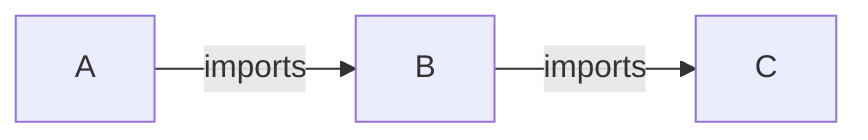

# R Minimum Dependency Check Action

## Description

Resolve and install minimal dependencies for a given package. Execute R CMD CHECK with minimal dependencies installed.
The aim is to check correctness of a `DESCRIPTION` file, i.e. minimal dependencies specification.
This covers only _direct_ dependencies, i.e. it does not resolve dependencies of dependencies recursively.

Example:


When executed for A, script would read A's `DESCRIPTION` file, determine minimal version of B and install it using latest version of C (i.e. base package installation).

Please see [`verdepcheck`](https://github.com/insightsengineering/verdepcheck) package documentation for details.

## Action type
Composite

## Author
Insights Engineering

## Inputs
* `github-token`:

  _Description_: Token with permissions to clone repositories with dependencies.

  _Required_: `false`

  _Default_: `""`

* `repository-path`:

  _Description_: Directory where the checked package has been cloned.

  _Required_: `false`

  _Default_: `repository`

* `check-args`:

  _Description_: Optional value of `args` argument to `rcmdcheck::rcmdcheck` in form of a string with space as delimeter, e.g. `"--no-examples --no-tests"`.

  _Required_: `false`

  _Default_: `""`

* `build-args`:

  _Description_: Optional value of `build_args` argument to `rcmdcheck::rcmdcheck` in form of a string with space as delimeter, e.g. `"--force --keep-empty-dirs"`.

  _Required_: `false`

  _Default_: `""`

* `strategy`:

  _Description_: Strategy for dependency test, should be one of: min, release, max.

  _Required_: `true`

* `additional-env-vars`:

  _Description_: Additional environment variables.

  _Required_: `false`

  _Default_: `""`


## Outputs

None

## Usage

```yaml
name: Dependency Test

on:
  push:
    branches:
      - main
  pull_request:
    branches:
      - main

jobs:
  check:
    runs-on: ubuntu-latest
    name: Dependency Test
    container:
      image: rocker/tidyverse:4.1.2

    steps:
      - name: Checkout repo
        uses: actions/checkout@v3
        with:
          path: repository

      - name: Run Dependency Test
        uses: insightsengineering/r-verdepcheck-action@v1
        with:
          github-token: ${{ secrets.REPO_GITHUB_TOKEN }}
          strategy: release

      - name: Upload lock file
        if: always()
        uses: actions/upload-artifact@v3
        with:
          name: lock-file
          path: pkg.lock
```
