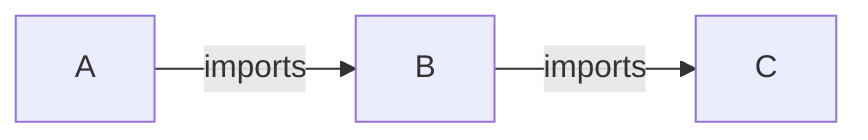

# R Version Dependency Check Action

## Description

Execute R CMD CHECK using various strategies of package dependencies versions.
The aim is to check correctness of a `DESCRIPTION` file, i.e. minimal version of dependencies.
This covers only _direct_ dependencies, i.e. it does not resolve dependencies of dependencies recursively.

Example:


When executed for A, script would read A's `DESCRIPTION` file, determine version of B and install it using latest version of C (i.e. base package installation).

Please see [`verdepcheck`](https://github.com/insightsengineering/verdepcheck) package documentation for details.

## Action type

Composite

## Author

[Insights Engineering](https://github.com/insightsengineering/)

## Inputs

| Input          | Description                                                     | Required | Default |
| -------------- | --------------------------------------------------------------- | ------- | ---- | 
| `github-token` | Token with permissions to clone repositories with dependencies. | _no_ | `""` |
| `repository-path` | Directory where the checked package has been cloned. | _no_ | `"repository"` |
| `extra-deps` | Extra dependencies specified similarly as in the `DESCRIPTION` file, i.e. `"<package name> (<operator> <version>)"` where both `<operator>` and `<version>` are optional. Multiple entries are possible separated by `";"`. | _no_ | `""` |
| `check-args` | Optional value of `args` argument to `rcmdcheck::rcmdcheck` in form of a string with space as delimeter, e.g. `"--no-examples --no-tests"`. | `false` | `""` |
| `build-args` | Optional value of `build_args` argument to `rcmdcheck::rcmdcheck` in form of a string with space as delimeter, e.g. `"--force --keep-empty-dirs"`. | `false` | `""` |
| `strategy` | Strategy for dependency test, should be one of: min, release, max. | _yes_ |  |
| `additional-env-vars` | Additional environment variables. | _no_ | `""` |
| `additional-repos` | Optional value that add R repositories for a given strategy. Multiple entries are possible separated by `";"`. | _no_ | `""` |

## Outputs

_None_

## Usage

```yaml
name: Dependency Test

on:
  push:
    branches:
      - main
  pull_request:
    branches:
      - main

jobs:
  check:
    runs-on: ubuntu-latest
    name: Dependency Test
    container:
      image: rocker/tidyverse:4.4.1

    steps:
      - name: Checkout repo
        uses: actions/checkout@v4
        with:
          path: repository

      - name: Run Dependency Test
        uses: insightsengineering/r-verdepcheck-action@latest
        with:
          github-token: ${{ secrets.REPO_GITHUB_TOKEN }}
          strategy: release

      - name: Upload lock file
        if: always()
        uses: actions/upload-artifact@v3
        with:
          name: lock-file
          path: pkg.lock
```
