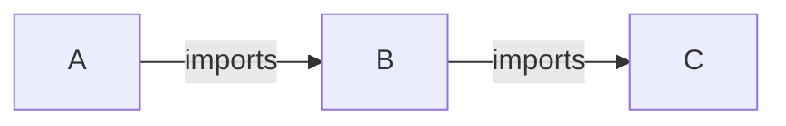

# R Minimum Dependency Check Action

## Description

Resolve and install minimal dependencies for a given package. Execute R CMD CHECK with minimal dependencies installed.
The aim is to check correctness of a `DESCRIPTION` file, i.e. minimal dependencies specification.
This covers only _direct_ dependencies, i.e. it does not resolve dependencies of dependencies recursively.

Example:


When executed for A, script would read A's `DESCRIPTION` file, determine minimal version of B and install it using latest version of C (i.e. base package installation).

Initial assessment of recursive functionality oftentimes leads to install compilation error of very old packages, errors in historical package releases that are not valid anymore or install requests of archived and not maintained packages. It's hard to decide what to do with it.

The functionality relies heavily on `pkgdepends::new_pkg_installation_proposal` and its dependency resolving mechanism.

## Action type
Composite

## Author
Insights Engineering

## Inputs
* `github-token`:

  _Description_: Token with permissions to clone repositories with dependencies.

  _Required_: `false`

  _Default_: `""`

* `repository-path`:

  _Description_: Directory where the checked package has been cloned.

  _Required_: `false`

  _Default_: `repository`

* `check-args`:

  _Description_: Optional value of `args` argument to `rcmdcheck::rcmdcheck` in form of a string with space as delimeter, e.g. `"--no-examples --no-tests"`.

  _Required_: `false`

  _Default_: `""`

* `build-args`:

  _Description_: Optional value of `build_args` argument to `rcmdcheck::rcmdcheck` in form of a string with space as delimeter, e.g. `"--force --keep-empty-dirs"`.

  _Required_: `false`

  _Default_: `""`

* `additional-env-vars`:

  _Description_: Additional environment variables.

  _Required_: `false`

  _Default_: `""`


## Outputs

None

## Usage

```yaml
name: Minimum dependency check

on:
  push:
    branches:
      - main
  pull_request:
    branches:
      - main

jobs:
  check:
    runs-on: ubuntu-latest
    name: Minimum dependency check
    container:
      image: rocker/tidyverse:4.1.2

    steps:
      - name: Checkout repo
        uses: actions/checkout@v3
        with:
          path: repository

      - name: Run dependency check
        uses: insightsengineering/r-mindepscheck-action@v1
        with:
          github-token: ${{ secrets.REPO_GITHUB_TOKEN }}

      - name: Upload lock file
        if: always()
        uses: actions/upload-artifact@v3
        with:
          name: lock-file
          path: pkg.lock
```
